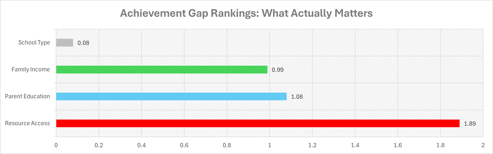
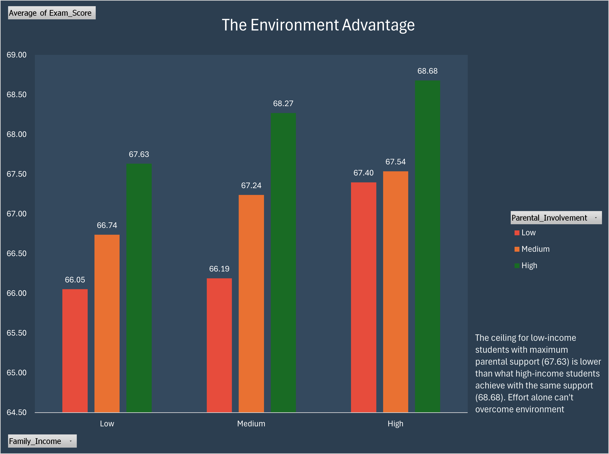

# student-achievement-gap-analysis
# Student Achievement Gap Analysis



## Overview

This project analyzes 6,607 student performance records to identify the true drivers of academic achievement gaps in education.

**Key Question:** What factors create achievement gaps between students from different socioeconomic backgrounds?

## Key Findings

### 1. School Type Doesn't Matter
- Private vs public schools: **0.08 point difference** (statistically negligible)
- Challenges the assumption that private school = better outcomes

### 2. Resources Are the Real Divider
- Quality of resource access: **1.89 point gap**
- 24x more impactful than school type
- 2x more impactful than family income alone

### 3. Effort Is Equal Across Income Levels
- Study hours: identical distribution (47-49% study 10-20 hours regardless of income)
- Tutoring access: 77-78% across all income groups
- Internet access: 92%+ universal

### 4. Parental Involvement Can't Close the Gap
- Rich students with low parental involvement (67.40) nearly match poor students with high involvement (67.63)
- Environment matters more than involvement alone

### 5. Tutoring Multiplies Privilege
- Low-income students: **+1.19 point benefit** from tutoring
- High-income students: **+3.56 point benefit** from tutoring
- **3x multiplier effect** - equal access ≠ equal outcomes

## Dashboard Preview

### Page 1: What Actually Matters

*Resource quality matters 24x more than school type*

### Page 3: The Privilege Multiplier

*Tutoring helps wealthy students 3x more than low-income students*

### Page 2: Environment vs Involvement

*Rich kids with uninvolved parents nearly match poor kids with highly involved parents*

## Methodology

**Data Source:** Kaggle Student Performance Dataset  
**Sample Size:** 6,607 students  
**Variables:** 20+ factors including study hours, attendance, parental involvement, resources, income, tutoring, etc.

**Analysis Process:**
1. Data cleaning and preparation (grouped categories, handled missing values)
2. Created calculated fields (score differences, improvement categories)
3. Built 12 pivot tables examining different factors
4. Cross-tabulated income, resources, tutoring, and performance
5. Designed 3-page interactive dashboard

**Tools:** Microsoft Excel (Pivot Tables, Charts, Statistical Analysis)

## Technical Skills Demonstrated

- Data cleaning and transformation
- Pivot table analysis (12 complex pivots)
- Statistical analysis and comparative metrics
- Data visualization and dashboard design
- Storytelling with data
- Professional documentation

## Files in This Repository

- `AbalakaVictor_Achievement_Gap_Analysis_2026.xlsx` - Complete Excel dashboard with:
  - Cover page and project overview
  - Key findings summary
  - 3-page interactive dashboard
  - Methodology documentation
  - All pivot tables and cleaned data
- `README.md` - This file
- `page1_achievement_gap_rankings.png` - Screenshot of Page 1
- `page3_privilege_multiplier.png` - Screenshot of Page 3
- `page2_parental_involvement.png` - Screenshot of Page 2

## How to Use

1. Download the Excel file
2. Open in Microsoft Excel (2016 or later recommended)
3. Start with the "Cover Page" tab for project overview
4. Navigate through "Dashboard - Page 1, 2, 3" for the full analysis
5. See "Methodology" tab for technical details

## Implications

This analysis reveals that simply providing equal access to interventions like tutoring may actually widen achievement gaps. Effective solutions must address:

- Quality of home study environments
- Parental education programs
- Access to high-quality supplementary materials
- Economic stress reduction
- Holistic support systems, not just single interventions

## Limitations

- Cross-sectional data (snapshot in time, cannot establish causation)
- "Same" performance category has smaller sample size (714 students)
- Dataset may not be representative of all student populations
- Further research needed on specific resource quality factors

## Author

**Abalaka Victor**  
📧 abalakavictor1234@gmail.com  
💼 Connect with me on LinkedIn *(coming soon)*  
🌐 View my portfolio *(coming soon)*

*Created: January 2026*
```

